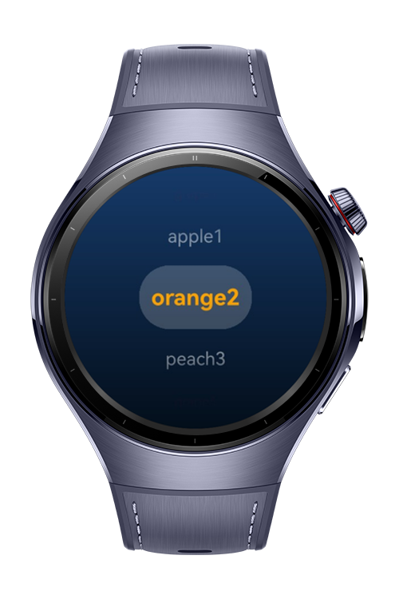

> **Note:** To access all shared projects, get information about environment setup, and view other guides, please visit [Explore-In-HMOS-Wearable Index](https://github.com/Explore-In-HMOS-Wearable/hmos-index).

# How to Control UI Components with the Digital Crown

This codelab shows how to use the digital crown on HarmonyOS wearables. You’ll learn how to capture crown rotation events and apply them to UI components like TextPicker and Slider for smooth, precise navigation.

# Preview

<p align="left">
  
  
  
  
</p>

# Use Cases

- Scroll through a TextPicker (e.g., selecting fruits, hours, minutes)
- Adjust numeric values smoothly (like volume or brightness)
- Navigate lists without touch input
- Control timers or counters with precise increments

# Tech Stack

- **Languages**: ArkTS, Typescript
- **Frameworks**: HarmonyOS SDK 5.1.0(18)
- **Tools**: DevEco Studio Vers 5.1.0.842
- **Libraries**: @kit.ArkUI

# Directory Structure

```entry/src/main/ets/
|---core
| |---services
| | |---NavigationService.ets
|---entryability
| |---EntryAbility.ets
|---entrybackupability
| |---EntryBackupAbility.ets  
|---pages
| |---Index.ets
| |---GaugePart.ets
| |---SliderPart.ets
| |---TextPickerPart.ets

```

# Constraints and Restrictions
## Supported Devices
- Huawei Watch 5


# LICENSE

CrownAbilities is distributed under the terms of the MIT License.
See the [LICENSE](/LICENSE) for more information.


